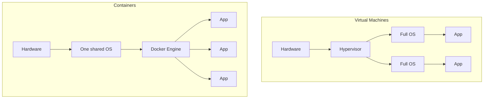
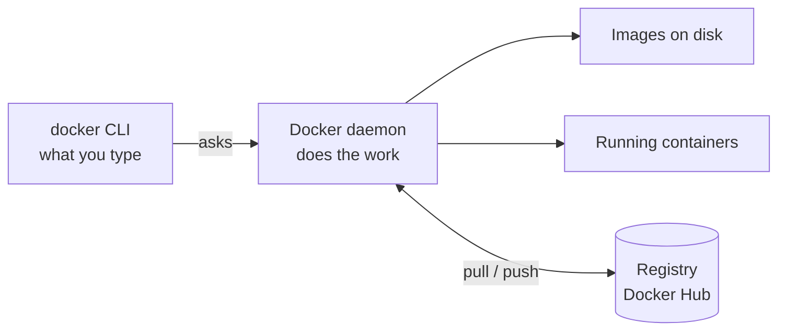
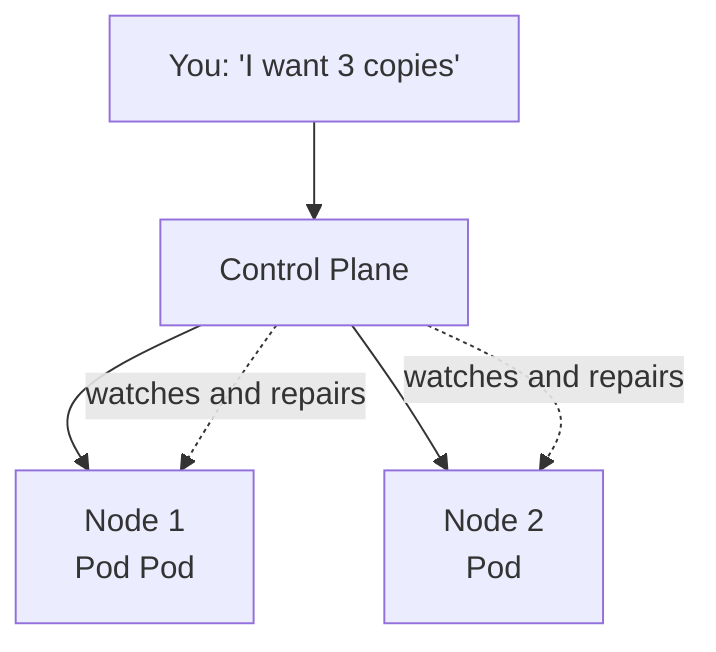

# Unit 3 — Notes
### Containerization and Cloud-Native DevOps

Read alongside the labs. Everything in this unit, in order.

**How to use these notes:** sections 1–7 and 9–11 are the unit. Section 8 is marked *optional* —
skip it on first read and come back if you are curious. Anything in a `code box` is something you
can type and watch happen.

---

# PART A — Docker

## 1. Why containers exist

Code that runs on your laptop fails on another machine because the two machines differ — Node
version, libraries, files, settings.

A **container** packages the application **together with everything it needs to run**: the runtime,
the libraries, and a minimal operating system.

**Virtualization** = running isolated environments on one physical machine.
**Container** = an isolated process that packages an app with its dependencies, sharing the host's
operating system kernel.

## 2. VM vs container



| | VM | Container |
|---|---|---|
| Carries | A whole operating system | App + dependencies |
| Size | Gigabytes | Megabytes |
| Boot | Minutes | **Seconds** |
| Isolation | Stronger | Good enough for most work |

A VM is a separate house. A container is a flat in an apartment block — own lockable space, shared
foundation.

**Not either/or:** in real clouds, containers usually run *inside* VMs.

## 3. Docker architecture



| Part | Job |
|---|---|
| **CLI** | What you type. Sends requests |
| **Daemon** | Background service that builds and runs containers |
| **Registry** | Where images are stored and shared |

If the daemon is not running, every command fails with `Cannot connect to the Docker daemon`.

**Docker Engine** = the CLI + the daemon together. When people say "Docker is installed on that
machine", this is what they mean.

Try it in the lab: `docker version` prints **two** sections, Client and Server. Two programs, not one.

> There is more machinery underneath this. You do not need it yet — it is in **section 8**, after
> you have met images, containers and volumes.

## 4. Image, container, Dockerfile

| Term | Meaning |
|---|---|
| **Dockerfile** | Text file of build instructions |
| **Image** | The sealed, read-only package built from it |
| **Container** | A running copy of an image |

```
Dockerfile --build--> Image --run--> Container
```

An image is **immutable**. Containers are **disposable**. One image can run many containers.

If you have done any object-oriented programming, the relationship is already familiar:

```
Class  →  Object
Image  →  Container
```

### The instructions you will meet

```dockerfile
FROM node:20-alpine        # base image to start from
WORKDIR /app               # working folder inside the image
COPY app.js index.html ./  # copy files in
EXPOSE 3000                # documents the port
CMD ["node", "app.js"]     # runs when a container starts
```

| Instruction | Note |
|---|---|
| `FROM` | Every image starts from another image |
| `WORKDIR` | Creates the folder if missing. Later paths are relative to it |
| `COPY` | Source is your build context, destination is inside the image |
| `RUN` | Executes a command **while building**, and the result is baked into the image |
| `EXPOSE` | **Documentation only.** Does not publish anything |
| `CMD` | Runs at container start, not at build time |

**Build context** — the path at the end of `docker build -t myapi ./api`. That folder is what gets
sent to the daemon, and it is the only thing `COPY` can read from. `COPY ../secrets .` fails for
exactly this reason.

**`EXPOSE` vs `-p`** — the most common confusion.
`EXPOSE 3000` is a note in the recipe. `-p 3000:3000` on `docker run` is what actually connects a port.

### `RUN` vs `CMD` — build time vs runtime

Two instructions both "run a command", and mixing them up causes most Dockerfile problems.
The difference is **when** they happen.

```dockerfile
FROM node:20-alpine
WORKDIR /app
COPY package*.json ./
RUN npm ci                 # BUILD time - installs dependencies INTO the image
COPY . .
CMD ["node", "app.js"]     # RUN time - the process the container starts
```

(`npm ci` just means "install exactly the dependency versions listed in the lock file".)

```
docker build
   |
   +-- RUN npm ci  -->  dependencies now inside the IMAGE
   |
   v
 IMAGE
   |
   | docker run
   v
 CONTAINER  -->  CMD node app.js
```

| | `RUN` | `CMD` |
|---|---|---|
| When | During `docker build` | When the container starts |
| How many times | Once, at build | Every time you run the image |
| Result stored in | The image (a new layer) | Nothing — it *is* the running process |
| Typical use | Install packages, compile | Start the app |

A `Dockerfile` can have many `RUN` lines. Only the **last `CMD`** counts.

Why it matters beyond Docker: everything slow (installing, compiling, testing) happens **once**, at
build time, and everybody who runs the image gets the finished result instantly. That is the whole
idea behind a CI/CD pipeline.

### Layers and caching

Each Dockerfile instruction creates one **layer**. Docker reuses unchanged layers, so the second
build is much faster — you will see `CACHED` in the output.

**Rule:** put the least-changing instructions at the **top**.

This is why the example above copies `package.json` **before** the rest of the source. Your
dependencies change rarely; your code changes constantly. Copy the code first and every one-line
edit re-runs `npm ci` and the build crawls.

## 5. Container networking

Inside a container, `localhost` means *that container*, not the machine and not other containers.

**Container network** = a private network where containers reach each other by **service name**,
resolved by Docker's built-in DNS.

Docker Compose creates that network for you, one per project, and joins every service to it:

```yaml
services:
  web:
    environment:
      API_URL: http://api:4000/info   # "api" is the service name below
  api:
    build: ./api
```

A container with **no published port** is unreachable from outside. Only containers on the same
network can reach it. This is how production systems hide databases.

## 6. Volumes

Containers are disposable. Delete one and anything written inside it is gone.

**Mount** = make some storage available at a particular path **inside** the container.
**Volume** = storage outside the container's filesystem, so data survives the container being deleted.

```yaml
volumes:
  - api-data:/data
```

| Command | Effect |
|---|---|
| `docker compose down` | Deletes containers. **Volume survives** |
| `docker compose down -v` | Deletes containers **and the volume** |

The container is the kettle; the volume is the water jug. Replace the kettle, the water stays.

This is why a database's data is never kept inside a container's own filesystem.

### Three kinds of mount

For the two you write with a colon, **the left-hand side tells you which one you have**:

```yaml
- api-data:/data        # a NAME → named volume. Docker picks where it lives
- ./data:/data          # a PATH → bind mount. You name the exact folder
```

| Type | Storage comes from | Who manages it | Survives container deletion? |
|---|---|---|---|
| **Named volume** | Host disk | **Docker** | Yes |
| **Bind mount** | Host disk | **You** — you name the exact folder | Yes, the files are just sitting there |
| **tmpfs** | RAM | The OS | **No** — gone when the container stops |

The third, `tmpfs`, is written as its own key rather than in `volumes:`, and you will rarely need it
in this unit — it is listed so the set is complete.

**Where does a named volume actually live?** On a Linux host, under
`/var/lib/docker/volumes/<name>/_data`. Docker creates no special disk — it is ordinary space on
the host's existing storage. The difference between the types is *who decides the location*,
not the hardware underneath.

**When to use which:**

- **Named volume** — data you want kept but never touch by hand: databases, uploads, our visit
  counter. `docker volume ls` and `docker volume inspect <name>` show them.
- **Bind mount** — development. Mount your source into the container (`- .:/app`) and the container
  sees your edits instantly, with no rebuild.
- **tmpfs** — scratch files and secrets you deliberately do not want written to disk.

### The same idea in Kubernetes

The mount idea does not change; only the thing supplying the storage gets bigger:

```
Docker:      container  →  named volume  →  host disk

Kubernetes:  Pod  →  PersistentVolumeClaim  →  PersistentVolume  →  AWS EBS / EFS / NFS
```

A Pod says "I need 10 GB of storage I can write to", and the cluster supplies it from real cloud
storage. The container still just sees a folder.

## 7. Docker Compose

**Compose** = starts several containers together from one YAML file, on a network it creates
automatically.

```yaml
services:
  web:
    build: ./web
    ports:
      - "3000:3000"                     # reachable from outside
    environment:
      API_URL: http://api:4000/info     # 'api' is the service name
    depends_on:
      - api

  api:
    build: ./api
    volumes:
      - api-data:/data                  # no 'ports' = private
volumes:
  api-data:
```

**Scaling limit:** one host port maps to **one** container. `--scale web=3` fails with a port error.
Running multiple copies behind one address needs a load balancer — which is what Kubernetes provides.

## 8. Going deeper — what is underneath (optional)

> **Not examinable, and not needed to finish the labs.** Read it when the rest feels comfortable.
> It answers "but what actually *is* a container?" and it explains something you will see in Part B.

### What happens when you type `docker run`

```bash
docker run -d -p 3000:3000 mywebapp
```

1. The **CLI** reads your command and sends it to the daemon.
2. The **daemon** checks: do I already have the `mywebapp` image here?
3. If not, it **pulls** it from a registry.
4. It builds the container's filesystem from the image's layers, and adds a thin **writable layer**
   on top — that writable layer is what disappears when you delete the container.
5. It sets up **networking** and applies your `-p 3000:3000` mapping.
6. It starts the image's `CMD` as the container's first process.

The CLI never touches a container itself. It only asks.

### A container is just a process

The daemon does not create the container directly either. It passes the job down:

```
docker CLI  →  dockerd  →  containerd  →  runc  →  Linux kernel
```

| Component | Job |
|---|---|
| `dockerd` | Images, networks, volumes, the Docker API |
| `containerd` | Starting, stopping and deleting containers |
| `runc` | Creating the actual process |

At the bottom there is no magic. A container is an ordinary Linux process with two kernel features
applied to it:

- **Namespaces** — give the process its own view of the filesystem, network and process list.
  This is *why* `ls` inside the container did not show your Codespace files in Lab 1.2.
- **cgroups** — limit how much CPU and memory it may use.

### Why you will meet `containerd` again

Kubernetes does **not** use Docker Engine to run your containers. It goes straight to the same
lower layer:

```
kubelet  →  containerd  →  runc
```

Kubernetes used to reach Docker through a translation layer called `dockershim`, and **removed it
in v1.24**. Headlines at the time said "Kubernetes deprecates Docker", which frightened a lot of
people unnecessarily: images you build with Docker still run perfectly on Kubernetes, because the
image format is an agreed open standard (**OCI**) rather than a Docker-only invention.

That is why, on the Killercoda Kubernetes playground in Lab 6, there is no `docker` command at all —
and your image from Docker Hub still runs.

## 📌 Part A summary

1. A container = app + dependencies, sharing the host OS. Small, fast.
2. `Dockerfile` → build → **image** → run → **container**.
3. Images are immutable; containers are disposable.
4. `EXPOSE` documents, `-p` publishes.
5. Containers talk **by name** on a shared network.
6. **Volumes** outlive containers.
7. Compose = many containers, one file, one command.

---

# PART B — Registries & Kubernetes

## 9. Registries and tags

**Registry** = a server that stores and distributes images.
**Tag** = the version label after the colon — `myapp:v1`.

An image name is an **address**:

```
docker.io / ravi / myapp : v1
registry   account  name   tag
```

### Registry vs repository vs image

These three words get used interchangeably and shouldn't be. Docker Hub works like GitHub:

```
Docker Hub               ← Registry    (the whole storage system)
  └── ravi/myapp          ← Repository  (all versions of ONE application)
        ├── :v1            ← Image/tag  (one specific build)
        ├── :v2
        └── :latest
```

| Registry | Provider |
|---|---|
| Docker Hub | Docker |
| Amazon ECR | AWS |
| GitHub Container Registry (GHCR) | GitHub |
| Azure Container Registry (ACR) | Microsoft |
| Google Artifact Registry | Google Cloud |
| Quay | Red Hat |

The registry is simply part of the image name, so an ECR image looks like this and needs no extra
configuration to pull:

```
123456789.dkr.ecr.ap-south-1.amazonaws.com/my-app:1.0
```

### Why the registry exists at all

After `docker build`, the image exists **only on the machine that built it**. Your server, your
teammate and your Kubernetes cluster cannot see it. Copying image files around by hand is not how
this works. Instead:

```
laptop or CI runner  --build-->  image  --push-->  registry  --pull-->  server / EKS / anywhere
```

That middle step is the entire reason registries exist, and it is precisely what a CI/CD pipeline
automates: **build → tag → push → deploy**.

### Why `:latest` is a trap

`latest` is not a version. It is a moving pointer to whatever was pushed last. Two people pulling
`:latest` a day apart get different software and cannot tell. **Tag with a version or the commit ID.**

Public registries: Docker Hub, GHCR, ECR, ACR.
Private registries: Nexus, Artifactory (Unit 2).

> **Registries are infrastructure, not a convenience.** In 2016 a developer unpublished `left-pad`,
> an 11-line npm package, and builds failed worldwide. This is why companies mirror registries.

```bash
docker login
docker build -t username/myapp:v1 .
docker push username/myapp:v1
```

The image name must start with **your** username, and must be **lowercase**.

## 10. Why orchestration

You have 50 containers across 10 machines. One crashes at 2 AM. One machine dies. A traffic spike
means you need 5 more copies.

Nobody does that by hand. That is **orchestration**.

**Kubernetes** = a system that runs containers across many machines and keeps them in the state
you asked for.

**Desired state** = you declare *what* you want; Kubernetes continuously compares that to reality
and repairs the difference. You never write the *how*.



### The words in that diagram

| Term | Meaning |
|---|---|
| **Cluster** | The whole thing: a set of machines managed together as one system |
| **Node** | One machine in the cluster. It runs your pods |
| **Control plane** | The brain. Accepts your instructions and keeps reality matching them |
| **kubectl** | The command-line tool *you* use to talk to the control plane |

You never tell a node what to do. You tell the **control plane** what you want, and it decides
which nodes run what — and re-decides every time something changes.

> 🎭 You phone the head office and say "I need three staff on the counter at all times."
> You do not phone individual branches, and you do not ring back when someone goes home sick.

### Where does a cluster come from? (and what is minikube?)

"Kubernetes" is the software. A **cluster** is a running installation of it, and you have to get
one from somewhere. There are two kinds:

| | For learning | For production |
|---|---|---|
| Examples | **minikube**, kind, k3s, Killercoda's playground | Amazon **EKS**, Google **GKE**, Azure **AKS** |
| Nodes | Usually **one**, on your own machine | Many, managed for you by the cloud provider |
| Costs | Nothing | Real money |
| Set-up | One command | A team and a budget |

**minikube** = a tool that runs a **complete, single-node Kubernetes cluster on one machine** —
your laptop, or in our case the Codespace. It is real Kubernetes, not a simulation: the same
`kubectl` commands, the same YAML, the same behaviour.

```bash
minikube start      # creates the cluster - takes a minute or two
kubectl get nodes   # one node, called "minikube"
minikube stop       # shut it down when you're finished
```

The catch is in the name: **one node**. You cannot demonstrate a machine failing, because there
is only one machine. Everything else in this unit — pods, deployments, services, self-healing,
scaling, rolling updates — works exactly as it would on a thousand-node cluster.

> **So which one will you use at work?** Almost certainly a managed one (EKS, GKE, AKS). But the
> commands you learn on minikube are the same commands. That is the whole reason it exists.

## 11. Pods, Deployments, Services

| Object | Job | Everyday equivalent |
|---|---|---|
| **Pod** | One running copy of your container | One worker |
| **Deployment** | Keeps N pods alive, handles updates | A supervisor |
| **Service** | Stable address + load balancing | The shop's phone number |
| **Node** | A machine in the cluster | A branch office |

A **Service** finds pods by **label**, not by name or IP — which is why pods can be replaced freely.

### Self-healing

Delete a pod that belongs to a Deployment and a new one appears within seconds. The Deployment's
only job is to keep the declared number of pods running.

```bash
kubectl delete pod <name>
kubectl get pods              # a replacement is already there
```

Nobody is paged. Nobody wakes up. This is the main reason industry moved to Kubernetes.

### Scaling and rolling updates

```bash
kubectl scale deployment web --replicas=5
kubectl set image deployment/web web=username/myapp:v2
kubectl rollout status deployment/web
kubectl rollout undo deployment/web        # instant rollback
```

Pods are replaced a few at a time, never all at once. That is the **rolling deployment** from
Unit 2 — and `rollout undo` is the instant rollback.

## 📌 Part B summary

1. An image name is an address: registry / account / name / **tag**.
2. Never deploy `:latest`.
3. **Pod** runs, **Deployment** keeps alive, **Service** gives a stable address.
4. Declare **desired state**; Kubernetes repairs reality to match.
5. Rolling updates and rollback are built in.

---

# Command reference

```bash
# images & containers
docker build -t name .            docker images
docker run -d -p 3000:3000 name   docker ps        # -a includes stopped
docker logs <name>                docker exec -it <name> sh
docker stop <name>                docker rm <name>  # rm -f = stop + remove

# compose
docker compose up --build         docker compose ps
docker compose down               docker compose down -v   # also deletes volumes

# registry
docker login                      docker push user/name:v1
docker pull user/name:v1

# kubernetes
kubectl get pods / nodes / svc    kubectl apply -f file.yaml
kubectl describe pod <name>       kubectl logs <pod>
kubectl scale deployment web --replicas=5
kubectl rollout undo deployment/web
```

---

# Troubleshooting

| Message | Cause | Fix |
|---|---|---|
| `Cannot connect to the Docker daemon` | Docker not running | Start Docker / restart the playground |
| `docker: command not found` | Wrong environment | Use the lab repo's Codespace, or Killercoda Ubuntu |
| `toomanyrequests` | Docker Hub anonymous pull limit, shared IP | `docker login` first |
| `port is already allocated` | Old container still running | `docker rm -f <name>` or change the host port |
| `The container name is already in use` | Names must be unique | `docker rm -f <name>` |
| One container cannot reach another | The api is down, or the container network is blocked | `docker compose logs api`; if a test request **hangs**, try `sudo iptables -P FORWARD ACCEPT` |
| `denied: requested access ... denied` | Not logged in, or wrong image name | `docker login`; name it `yourusername/...` |
| `repository name must be lowercase` | Capitals in the image name | Use lowercase |
| `ImagePullBackOff` | Wrong image name, or private repo | Make the Docker Hub repo Public |
| `CrashLoopBackOff` | The app starts then dies | `kubectl logs <pod>` |
| Pod stuck `Pending` | Cluster still starting | `kubectl get nodes`, wait |
| Data gone after restart | It was inside the container | Use a volume |
| Page won't open in Codespaces | Port not forwarded | **Ports** tab → forward 3000 |

---

# Glossary

| Term | Meaning |
|---|---|
| Virtualization | Running isolated environments on one machine |
| Image | Sealed, read-only package of an app + dependencies |
| Container | A running copy of an image |
| Dockerfile | Instructions used to build an image |
| Build context | The folder you pass to `docker build`; the only source `COPY` can read |
| Layer | One step of a Dockerfile; cached and reused |
| Docker Engine | The Docker CLI plus the daemon (`dockerd`) |
| containerd | The runtime the daemon delegates container lifecycle to |
| runc | Creates the container process using kernel namespaces and cgroups |
| Namespaces / cgroups | Kernel features that isolate a process and cap its resources |
| Registry | Where images are stored and shared |
| Repository | All the tags of one application inside a registry |
| Tag | The version label on an image |
| Mount | Making storage available at a path inside a container |
| Volume | Storage that outlives the container; Docker chooses where it lives |
| Bind mount | A specific host folder mapped into the container |
| tmpfs | Storage held in RAM; lost when the container stops |
| Compose | Runs multiple containers from one YAML file |
| Kubernetes | Runs containers across many machines |
| Cluster | A set of machines running Kubernetes, managed as one system |
| Node | One machine in the cluster; it runs pods |
| Control plane | The part of Kubernetes that accepts your instructions and repairs reality to match |
| kubectl | The command-line tool you use to talk to a cluster |
| minikube | Runs a complete single-node Kubernetes cluster on one machine, for learning |
| EKS / GKE / AKS | Managed Kubernetes from AWS / Google / Azure |
| Pod | Smallest unit Kubernetes runs; usually one container |
| Deployment | Keeps N pods running; handles updates |
| Service | Stable address and load balancer for pods |
| PersistentVolumeClaim | A Pod's request for storage in Kubernetes |
| Desired state | What you declared; Kubernetes makes reality match |
| Self-healing | Automatic replacement of failed pods |

---

# Exam and interview questions

1. VM vs container — what is actually different?
2. Image vs container?
3. `RUN` vs `CMD` — when does each one execute, and where does the result end up?
4. What is a Dockerfile layer cache, and how do you order instructions to use it?
5. Why copy `package.json` into the image before the rest of the source?
6. `EXPOSE` vs `-p`?
7. A container lost its data on restart. Why, and what is the fix?
8. Named volume vs bind mount — who decides where the data lives?
9. How do two containers talk to each other?
10. Registry vs repository vs tag?
11. Why is deploying `:latest` a bad idea?
12. Walk through what happens when you type `docker run`.
13. What problem does Kubernetes solve that Docker alone does not?
14. What is a cluster, a node and the control plane?
15. What is minikube, and how is it different from EKS or GKE? What can you *not* demonstrate on it?
16. Pod vs Deployment vs Service?
17. What does "desired state" mean?

---

# Further reading

- Docker docs and labs — `https://docs.docker.com/guides/`
- Kubernetes basics — `https://kubernetes.io/docs/tutorials/kubernetes-basics/`
- Killercoda — `https://killercoda.com`
- Unit 2 reference repo — `https://github.com/ravissajjan/demo`
